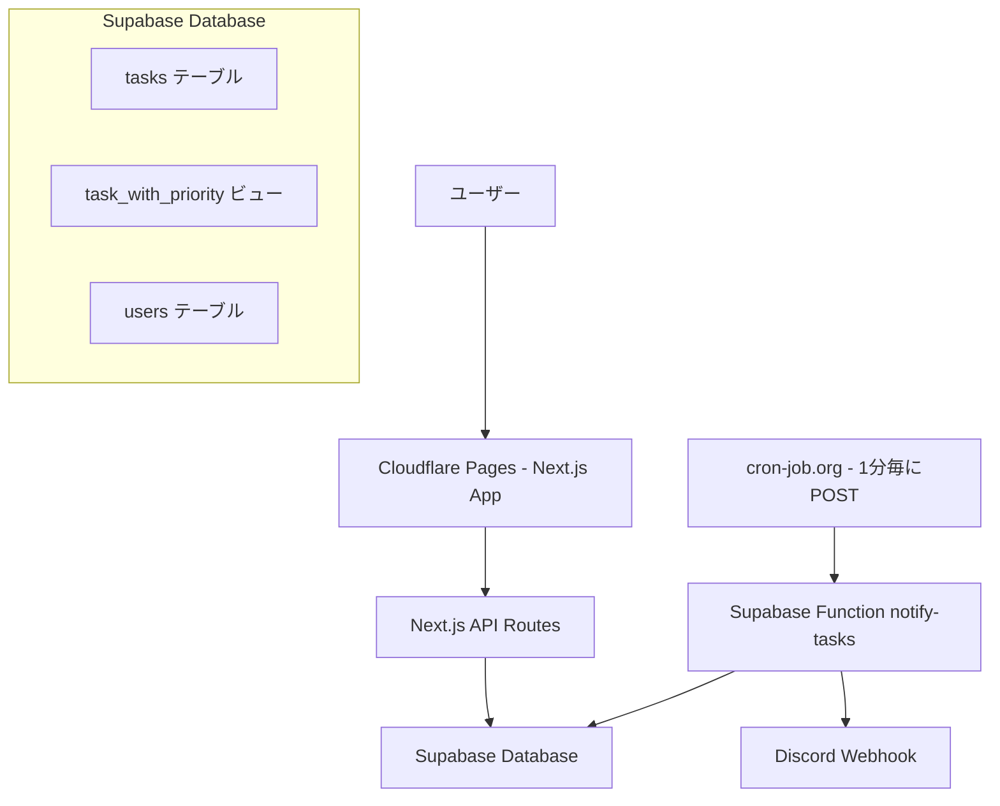

```mermaid
flowchart TD
  A[ユーザー] --> B[Cloudflare Pages - Next.js App]
  B --> C[Next.js API Routes]
  C --> D[Supabase Database]
  subgraph DB [Supabase Database]
    E[tasks テーブル]
    F[task_with_priority ビュー]
    G[users テーブル]
  end
  H[cron-job.org - 1分毎にPOST] --> I[Supabase Function notify-tasks]
  I --> D
  I --> J[Discord Webhook]

```